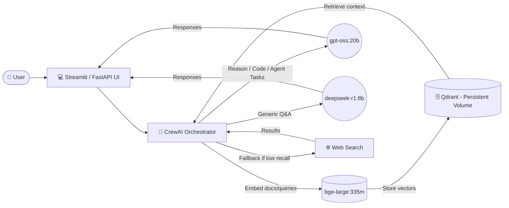

```mermaid
flowchart LR
    User([🧑 User]) --> UI[💻 Streamlit / FastAPI UI]
    UI --> CrewAI[🤖 CrewAI Orchestrator]
    CrewAI -->|Embed docs/queries| Embeddings[(bge-large:335m)]
    Embeddings -->|Store vectors| Qdrant[(🗄️ Qdrant - Persistent Volume)]
    Qdrant -->|Retrieve context| CrewAI
    CrewAI -->|Reason / Code / Agent Tasks| Reasoning((gpt-oss:20b))
    CrewAI -->|Generic Q&A| Chat((deepseek-r1:8b))
    CrewAI -->|Fallback if low recall| WebSearch[🌐 Web Search]
    WebSearch -->|Results| CrewAI
    Reasoning -->|Responses| UI
    Chat -->|Responses| UI
```